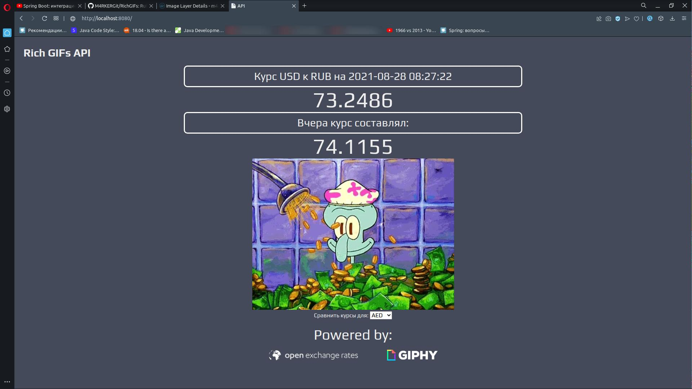

# RichGIFs

Тестовое задание, выполненное на Spring Boot 2.5.4 + Gradle 7.2
"Создать сервис, который обращается к сервису курсов валют, и отдает gif в ответ"

## Общая информация:
* Реализованы четыре endpoint'а для API: /, /all, /api/{currency} и /gif/{currency}
* Курсы валют и подборки гифок выгружаются при первом GET-запросе в endpoint после запуска, затем обновляются каждый час, чтобы ответ сервиса был максимально быстрым, и не тратились лимитированные реквесты
* Для работы с JSON использовал Jackson
* Обращения к внешним API через Feign
* Разработка и тестирование велись на OpenJDK 15.0.2 + IndelliJ IDEA Ultimate 2021.1.3 + Linux Mint 20.2 (5.11.0-27)
* Имеется три пакета тестов: unit для проверки функций анализа и форматирования, интеграционные для проверки REST-контроллера через мок интерфейсов Feign, и REST Assured тесты для тестирования уже запущенного приложения (по сути, заменяет тыкание ручками)
* Базовая валюта (по отношению к которой смотрим остальные) вынесена в config.properties, равно как и ключи для внешних API и гифки, отправляемые в случае равенства курсов/возникновения исключения
* Реализована сборка контейнера Docker(20.10.8) через Dockerfile, контейнер залит на мой dockerhub: https://hub.docker.com/repository/docker/m4rker/richgifs-docker

## Инструкция по запуску:

### Вариант 1 (со сборкой):
* Скачиваем архив с этим проектом
* Распаковываем в любое удобное место
* Собираем его через gradle (./gradlew bootJar, либо есть скрипт ./execute для сборки + запуска)
* Вписываем в config.properties свой exchangeKey и gifsKey (ключи от внешних API)
* Запускаем (java -jar build/libs/richGIFs-V1.0.jar)

### Вариант 2 (просто .jar):
* Скачиваем release архив
* Распаковываем все файлы в одну папку
* Запускаем (java -jar richGIFs-V1.0.jar)

### Вариант 3 (docker контейнер):
* Клонируем себе контейнер (docker pull m4rker/richgifs-docker:latest)
* Запускаем его на 8080 порте (docker run --publish 8080:8080 m4rker/richgifs-docker), по желанию добавляем опцию -d для запуска в фоне

## Использование:
Существует четыре endpoint'a, в которые можно обращаться:
* / - веб-интерфейс API, самый удобный и понятный вариант пользоваться сервисом, при открытии выдает курс доллара к базовой валюте, но с помощью селектора под гифкой можно получить другие курсы
* /gif/{валюта} - просто получить гифку, в {} необходимо вписать интересующую Вас валюту в трехбуквенном формате: EUR, USD, RUB и т.п.
* /api/{валюта} - получить JSON-ответ от API, включащий поля: сообщение-хедер, курс валюты сегодня, курс валюты вчера, ссылка на гифку
* /all - получить курсы всех валют к доллару, выдает JSON

